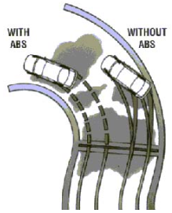
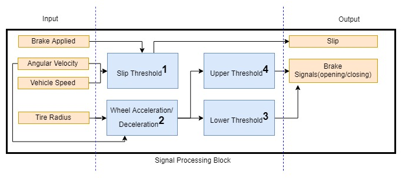
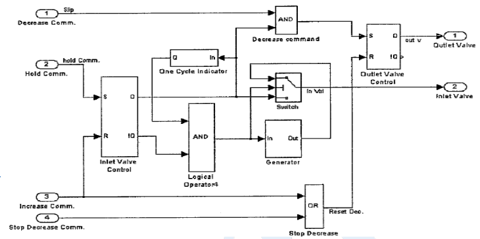
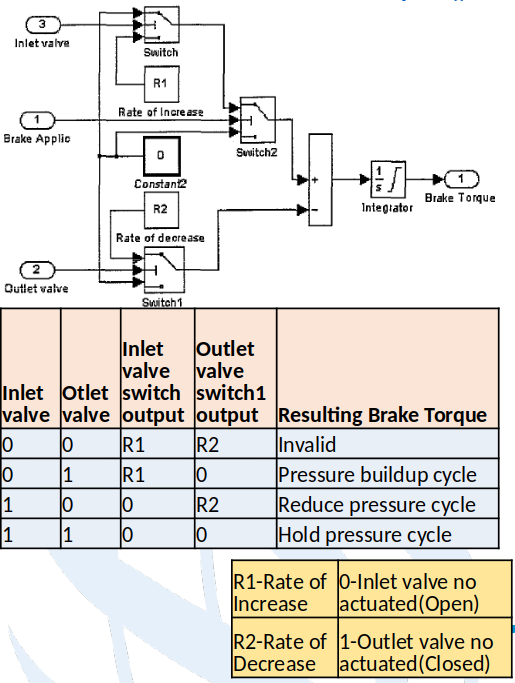
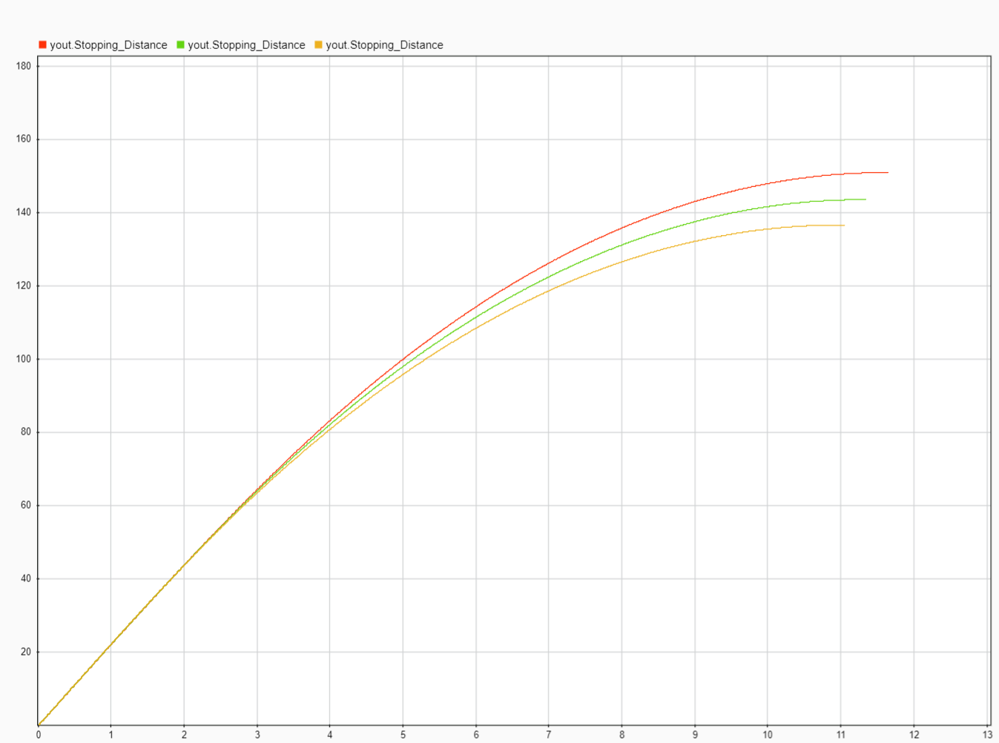
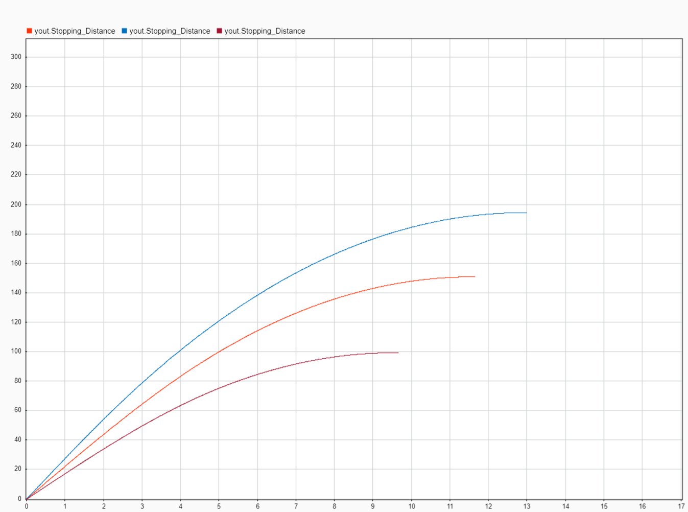
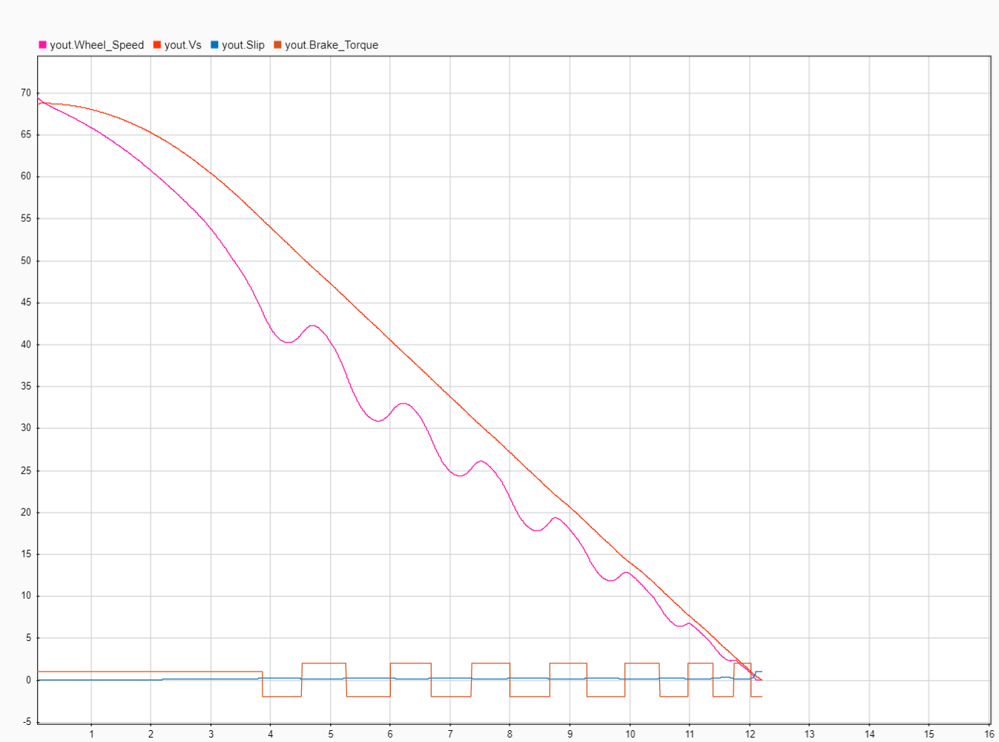
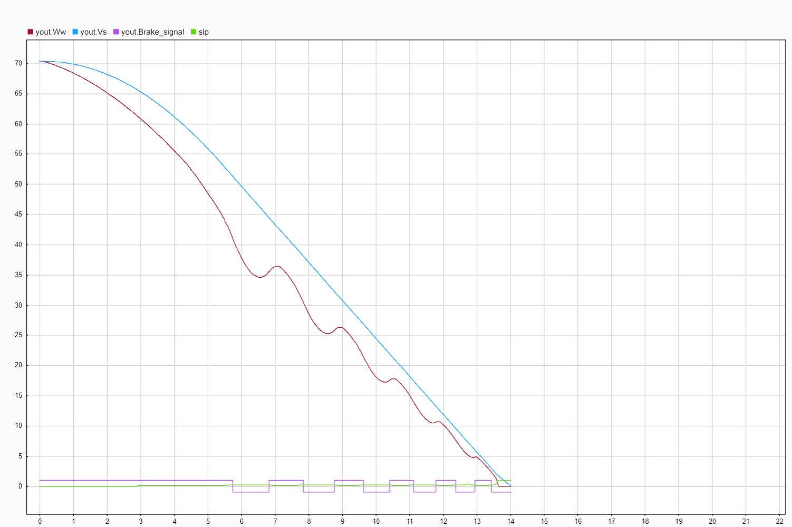

## ABS or Anti-lock Braking System
- Anti-lock braking system(ABS) is an automobile safety system prevent the wheels of a vehicle locking as brake pedal pressure is applied - often suddenly in an emergency or short stopping distance. This enables the driver to have steering control, preventing skidding and loss of traction

- The brake pressure – which is being applied through a hydraulic fluid that is pumped throughout the system as a result of the driver pressing on the brake pedal – is momentarily released, the brakes are freed and the car’s wheels and tires can revolve again. This intervention happens hundreds of times a second. By releasing and reapplying the brakes, the car’s ABS prevents it going into a brake-induced skid, enabling the driver to continue to steer.

- Slip Threshold: This subsystem processes Angular Velocity and Linear velocity to calculate Slip of wheel. Slip is derived from this formula 
    - Slip=1.0-Angular Velocity/Linear Velocity+(linear Velocity==0)*eps
- Wheel acceleration/deceleration: This subsystem calculates wheel acceleration/deceleration and creates signal for ABS valve opening and closing.
- Lower Threshold : This subsystem calculates lower speed threshold and compares with slip threshold
- Upper Threshold : This subsystem calculates upper threshold and compares with slip threshold.

- Input 
    - Brake Applied- Data type: Boolean(True /False).
    - Angular Velocity – Data type: float.
    - Vehicle Speed- Data type: float.
    - Tire Radius –Data type: float.
- Output
    - Slip – Data type: float (0<slip<1).
    - Brake Signals -Data type Boolean(True/false).
    
## Architecture

## Logic Controller Block(LCB)

- The criteria to decide to hold, decrease or increase the brake torque depend on momentary values of the wheel angular velocity, vehicle velocity and peripheral wheel acceleration.
- Objective of logic controller block is to maintain the slip value around preset value and decrease the stopping distance by actuating Inlet and Outlet valve.
- Outlet valve Control: When Outlet Valve Control flip-flop is Set (i.e. Decrease Command is received) AND Inlet valve is closed then only outlet valve will be open and when flip flop is Reset(i.e. Increase Command OR Stop Decrease Command is received), valve is closed.
- Inlet valve Control: When Inlet Valve Control flip-flop is Set (i.e. Hold Command is received), inlet valve will be closed and when flip flop is Reset (i.e. Increase Command is received), valve is open.
- When One Cycle Indicator receives Active signal (i.e. Hold Command is received once) it will always generate High/Active output.
- Generator will receive Active signal only when Increase Command is received AND output of One Cycle Indicator is Active. When generator receives Active signal, it starts to generate pulses command for inlet valve to open and close. As a result the rate of brake torque increase depends on the duty cycle.
## Brake Torque Modulator Block (BTM)
Brake torque is assumed to be directly proportional to the brake pressure.
- The BTM in current model has one Inlet and one Outlet valve. It has three cycles of operation based on the valve actuation conditions (Pressure buildup cycle, Hold pressure cycle, Reduce pressure cycle).
- To initiate brake Boolean ‘1’ is applied at the ‘Brake Applied’ input. Then the ‘Switch 2’ connects ‘Rate of Increase’ to the ‘Integrator’. This increases the Brake Torque at the rate of ‘R1’ until the Inlet valve is actuated. This is ‘Pressure buildup cycle’.
- Once the Inlet valve is actuated, the ‘Switch’ connects to ‘Constant 2’ and in turn connects to ‘Integrator’ via ‘Switch 2’ and sum block. This is ‘Hold pressure cycle’.
- Once the Outlet valve is actuated during pressure hold cycle, the ‘Switch 1’ connects Rate of Decrease’ to the ‘Integrator’. This decreases the Brake Torque at the rate of ‘R2’. This is ‘Reduce pressure cycle’.
- The output value of the ‘Integrator’ is limited to the lower saturation level zero and upper saturation level can be set to maximum brake torque that is required to realize by this brake system.

## Controller & System parameters
- g=gravity-9.8m/sec2
- I= Mass Inertia – 1.04 Kg-m2
- m=mass of quarter vehicle model – 250~450kg
- Rr= Effective rolling radius – 0.356m
- TB= Brake Torque – 0.01nm
- v0= Initial Speed of the vehicle (16.6~27.7m/s).

## Output

### Weight Vs Stopping Distance
- Red : M=450kg Speed 22m/s
- Green: M=350kg Speed 22m/s
- Yellow : M=250kg Speed 22m/s
- X axis Time
- Y axis Distance in meters

### Speed Vs stopping distance
- Red : M=450kg(1/4) Speed 27.77m/s
- Green: M=450kg(1/4) Speed 22m/s
- Yellow : M=450kg(1/4) Speed 16.66m/s
- X axis Time
- Y axis Distance in meters

### Brake working Designed Model
- X axis Time
- Y axis Amplitude
- Vehicle Speed 24.44m/s

### Brake working Standard Matlab Model
- X axis Time
- Y axis Amplitude
- Vehicle Speed 24.77m/s

### Future Improvement Scope
- QVT model implementation
- Slip function modification.
- logic controller block modification(One cycle indicator).
- Modification in Brake torque modulator (Saturation limit).
